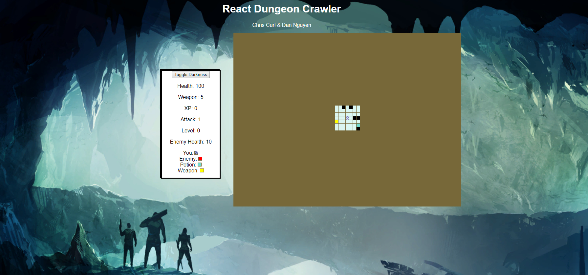

This project was bootstrapped with [Create React App](https://github.com/facebookincubator/create-react-app).

Outline of design strategy:
1. Create simple grid of 100x100squares
2. Allow user to move around grid
3. Register user moves and track location on grid
4. Track player movements relative to game array
4. Add walls
5. Add enemies, potions, weapons and 1 boss.
6. Track player health and potions and stuff.
6. Randomize board
7. Make original map more complex.
8. Add style, sounds, icons etc.

